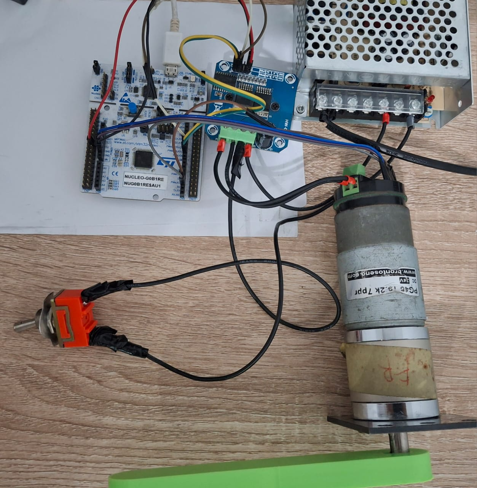
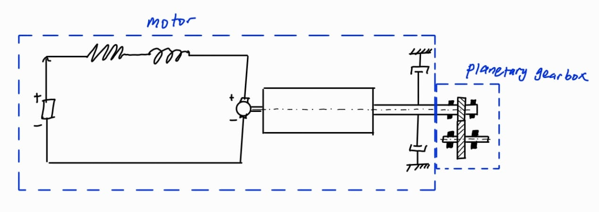

# Velocity Control of a DC Motor Using Feedback Linearization and LuGre Based Friction Extended State Observer

**This project implements feedback linearization and a simple PI controller for precise velocity control of a brushed DC motor. Additionally, a LuGre\-based observer is used to estimate and compensate for friction and external disturbances, enhancing control performance.**


Irfan Yafi Pranoto 13122077


ITB FMAE, Mechanical Engineering

# Research Equipment





In this research, i use a 70 Watt (output power) DC motor PG45 Brontoseno, BTS7960 motor driver, power supply (24 V and 5 A), and an STM32 Nucleo G0B1RE microcontroller

# BDC Motor Modelling

Documentation on modelling and parameter identification can be accessed through the following link below


[https://github.com/IrfNyafi/Modelling\-and\-Parameter\-Identification\-of\-Brushed\-DC\-Motor.git](https://github.com/IrfNyafi/Modelling-and-Parameter-Identification-of-Brushed-DC-Motor.git) 


 $$ \frac{d\omega \left(t\right)}{\textrm{dt}}=\rho \left(t\right)\left(-0\ldotp 1628|\omega \left(t\right)|+11\ldotp 04\right)-0\ldotp 7184\omega \left(t\right)-167037\ldotp 21858901123z-4569\ldotp 25\frac{\textrm{dz}}{\textrm{dt}} $$ 

 $$ \frac{\mathrm{dz}\left(t\right)}{\mathrm{dt}}=\omega \left(t\right)-\frac{1336\ldotp 29774871209|\omega \left(t\right)|z}{0\ldotp 1668+0\ldotp 29525698321793e^{-{\left(\frac{\omega }{0\ldotp 561797287214991}\right)}^2 } } $$ 

-  $\rho \left(t\right)$ is the average voltage define as percentage duty cycle times the input supply voltage 
-  $z\left(t\right)$ is the internal LuGre friction state 
-  $\omega \left(t\right)$ is the motor speed 
# Non\-linear Luenberger Observer

let us consider the following model

 $$ \frac{d\omega \left(t\right)}{\mathrm{dt}}=\rho \left(t\right)\left(a_1 |\omega \left(t\right)|+a_2 \right)-\beta \omega \left(t\right)-\frac{\sigma_0 }{J}z-\frac{\sigma_1 }{J}\frac{\mathrm{dz}}{\mathrm{dt}}+f\left(t\right) $$ 

 $$ \frac{\mathrm{dz}\left(t\right)}{\mathrm{dt}}=\omega \left(t\right)-\frac{\sigma_0 |\omega \left(t\right)|z}{T_c +\Delta Te^{-{\left(\frac{\omega }{\omega_s }\right)}^2 } } $$ 

 $f\left(t\right)$ is generalized disturbance which is the combination of internal disturbance (arises from modeling errors) and external disturbance (comes from external torque exerted by the environoment). By the above model, we design the observer as follow

 $$ \frac{d\hat{z} \left(t\right)}{\textrm{dt}}=\omega \left(t\right)-\sigma_0 \frac{|\omega \left(t\right)|}{h\left(\omega \right)}\hat{z} \left(t\right)+K_1 \left(\omega \left(t\right)-\hat{\omega } \left(t\right)\right) $$ 

 $$ \frac{d\hat{\omega } \left(t\right)}{\textrm{dt}}=-\frac{\sigma_o }{J}\hat{z} -\frac{\sigma_1 }{J}\frac{d\hat{z} \left(t\right)}{\textrm{dt}}-\frac{F_v }{J}\omega \left(t\right)+\hat{f} \left(t\right)+u\left(t\right)+\frac{K_2 }{J}\left(\omega \left(t\right)-\hat{\omega } \left(t\right)\right) $$ 

 $$ \frac{d\hat{f} \left(t\right)}{\mathrm{dt}}=K_3 \left(\omega \left(t\right)-\hat{\omega } \left(t\right)\right) $$ 

Documentation of the observer can be found here, [https://github.com/IrfNyafi/Lugre\-Friction\-Model\-Based\-Observer\-For\-Friction\-Compensation\-of\-DC\-Motor\-Motion\-Control.git](https://github.com/IrfNyafi/Lugre-Friction-Model-Based-Observer-For-Friction-Compensation-of-DC-Motor-Motion-Control.git) 

# Control System Law: Modified PI Controller Using Feedback Linearization

let us define

 $$ u\left(t\right)=\rho \left(t\right)\left(a_1 |\omega \left(t\right)|+a_2 \right)-\beta \omega \left(t\right)-\frac{\sigma_0 }{J}z-\frac{\sigma_1 }{J}\frac{\mathrm{dz}}{\mathrm{dt}}+f\left(t\right) $$ 

then our dynamic model can be written as first order dynamic model

 $$ \frac{d\omega \left(t\right)}{\mathrm{dt}}=u\left(t\right) $$ 

define the error dynamics

 $$ e\left(t\right)=\omega_d -\omega \left(t\right) $$ 

 $$ \dot{e} \left(t\right)={\dot{\omega } }_d \left(t\right)-\dot{\omega} \left(t\right)={\dot{\omega } }_d \left(t\right)-u\left(t\right) $$ 

we design the control input law $u\left(t\right)$ using simple proportional integral controller. The writer choose the control input to be

```math
 u\left(t\right)={\dot{\omega } }_d \left(t\right)+K_p e\left(t\right)+K_i \int_{t_0 }^{\tau } e\left(\tau \right)d\tau
```

substitute the proposed control law to the error dynamics, we will get

```math
 \dot{e} \left(t\right)={\dot{\omega } }_d \left(t\right)-\dot{\omega} \left(t\right)={\dot{\omega } }_d \left(t\right)-{\dot{\omega } }_d \left(t\right)-K_p e\left(t\right)-K_i \int_{t_0 }^{\tau } e\left(\tau \right)d\tau
```


$$ \dot{e} \left(t\right)+K_p e\left(t\right)+K_i \int_{t_0 }^{\tau } e\left(\tau \right)d\tau =0 $$

similar dynamics

 $$ \ddot{e} \left(t\right)+K_p \dot{e} \left(t\right)+K_i e\left(t\right)=0 $$ 

based on that, the gain $K_p$ and $K_i$ is chosen to be Hurwitz to ensure stability. We can also use pole placement technique to make tuning easier. Let us define $P_1$ and $P_2$ as the desire error dynamic poles. Construct the desire characteristic equation

 $$ \left(s-P_1 \right)\left(s-P_2 \right)=0 $$ 

 $$ s^2 -\left(P_1 +P_2 \right)s+P_1 P_2 =0 $$ 

thus, we get $K_p =-\left(P_1 +P_2 \right)$ and $K_i =P_1 P_2$ .


We conclude the control law as the following:

```math
u(t) = \dot{\omega}_d(t) + K_p e(t) + K_i \int_{t_0}^{\tau} e(\tau) d\tau
= \rho(t) \left( a_1 |\omega(t)| + a_2 \right) - \beta \omega(t) - \frac{\sigma_0}{J} \hat{z} - \frac{\sigma_1}{J} \frac{d\hat{z}}{dt} + \widehat{f}(t)
```
<<<<<<< HEAD

```math
\rho(t) = \frac{\dot{\omega}_d(t) + K_p e(t) + K_i \int_{t_0}^{\tau} e(\tau) d\tau + \beta \omega(t) + \frac{\sigma_0}{J} \hat{z} + \frac{\sigma_1}{J} \frac{d\hat{z}}{dt} - \widehat{f}(t)}{\left( a_1 |\omega(t)| + a_2 \right)}
```


=======

```math
\rho(t) = \frac{\dot{\omega}_d(t) + K_p e(t) + K_i \int_{t_0}^{\tau} e(\tau) d\tau + \beta \omega(t) + \frac{\sigma_0}{J} \hat{z} + \frac{\sigma_1}{J} \frac{d\hat{z}}{dt} - \widehat{f}(t)}{\left( a_1 |\omega(t)| + a_2 \right)}
```
>>>>>>> 87b6c59e65b2ca5988b987ed88d8c7f151d99387

the values of $\hat{z}$ , $\frac{d\hat{z} }{\mathrm{dt}}$ , and $\widehat{f} \left(t\right)$ are obtained from the nonlinear Luenberger observer

